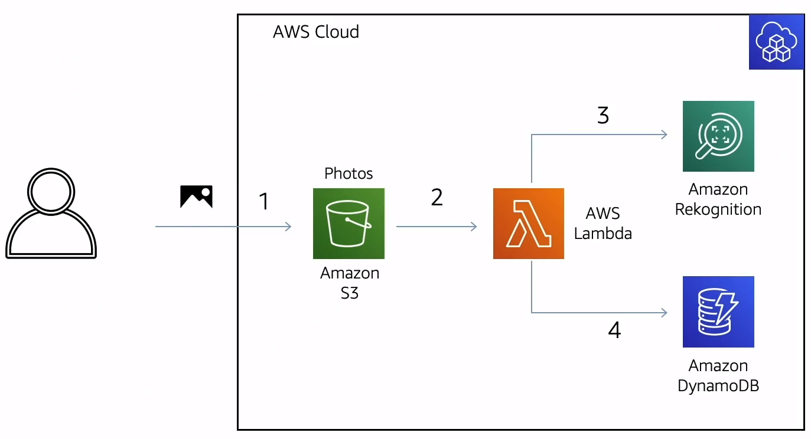

# Image recognition using Cloud Development Kit (CDK) 

This is the hands-on from AWS re:Invent 2020/21 speak [Modelling and provisioning apps with AWS CDK](https://virtual.awsevents.com/media/1_ducee6iw)
<br />
<p align="center">
  
</p><br />

#### Requirements
* AWS CLI
* AWS account
* Cloud Development Kit (CDK)

### Instructions
* Clone the repo and install the dependencies with `npm i`
* Configure your aws profile with the aws account credentials you want to use for the deployment
```bash
export AWS_DEFAULT_PROFILE=<your aws profile>
```
`TIP` You can check your current credentials with `aws configure list`
* In the case this is the first time you deploy in that AWS environment (account/region) you need to install a bootstrap stack
```bash
cdk bootstrap
``` 
* Deploy with
```bash
cdk deploy
```
Take note of the `CdkAppStack.Bucket` and `CdkAppStack.Table` CloudFormation outputs.
* Copy an image to the bucket
```bash
aws s3 cp <path to your image> s3://<CdkAppStack.Bucket>
```
* Check the labels detected by Rekognition written in the table
```bash
aws dyanmodb scan --table-name <CdkAppStack.Table>
```
* Remove the app
```bash
cdk destroy
```
